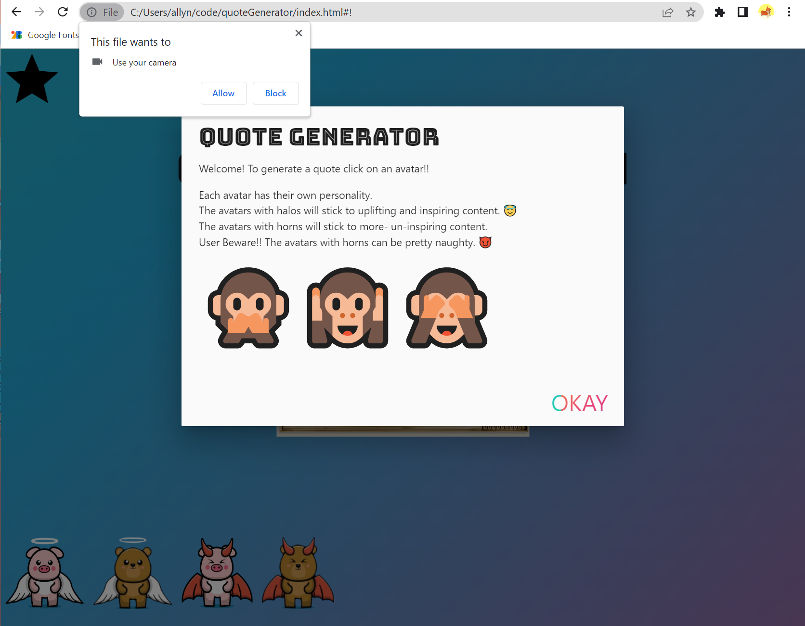
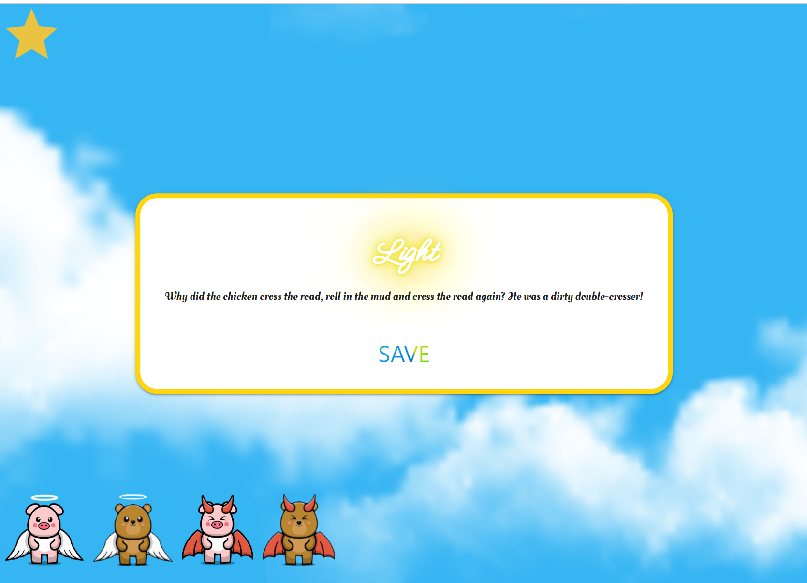
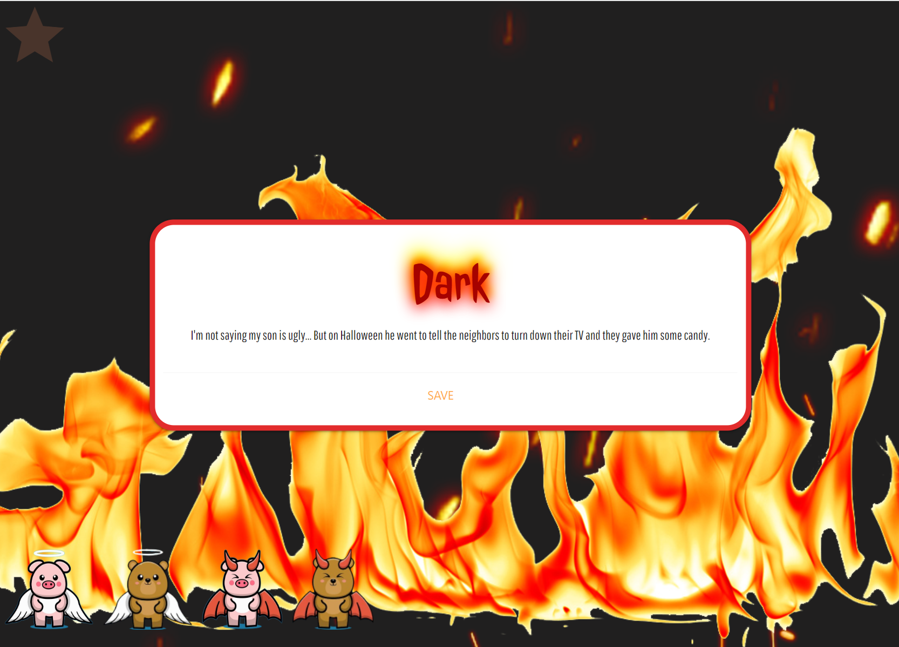
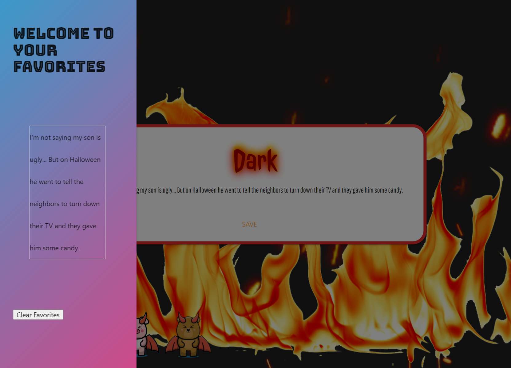
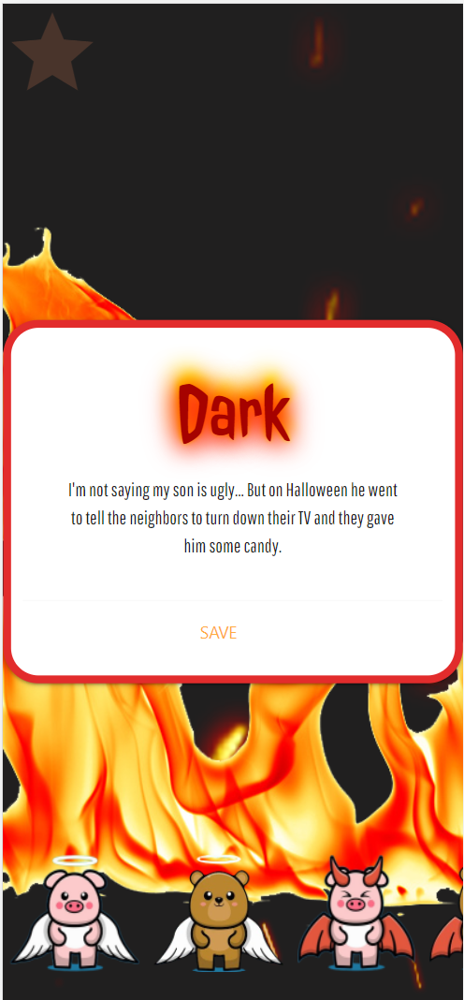

# QuoteGenerator

## Link
Quote Generator https://derrikhan.github.io/quoteGenerator/

## Description 

For our first project in the UW Coding Bootcamp program, we created a fun website that implements the use of at least 2 api's that we haven't used in class before. 

Our website includes the following api's...
- Inspiration https://inspiration.goprogram.ai/docs/
- Jokeapi https://v2.jokeapi.dev/joke/Any?safe-mode
- What does Trump think https://api.whatdoestrumpthink.com/api/v1/quotes/random
- Video Elements Mozilla https://developer.mozilla.org/en-US/docs/Web/HTML/Element/video

### USER STORY

AS a hardworking individual with a busy schedule 

I WANT a custom joke generator

SO THAT I can have a quick laugh

## Functionality
Upon loading the page the user is drawn to two diferent elements. 

One of which being that the website asks for permission to use the users front camera, and will display the users face upon accepting! 

The second is being presented with a modal that describes the basic functionality. Click an avatar and receive a response. Once the user closes the modal they have 4 avatars displayed in front of them that when clicked- up pops a "speech bubble" of what that avatar says. In the speech bubbles there are save buttons that when clicked will save the content of the speech bubble to the users local storage and adds it to the favorites list.

There is a star icon at the top left of the page that when clicked will pop out a sidebar where the user can find their favorites that they have saved. There is a button for clearing your favorites which is not yet a working function. However, this is one of our plans for the future!

## Screenshots

Here is what the page looks like upon loading 

Upon clicking a "angel" avatar

Upon clicking a "devil" avatar

Upon clicking the star at the top left

Mobile responsiveness
